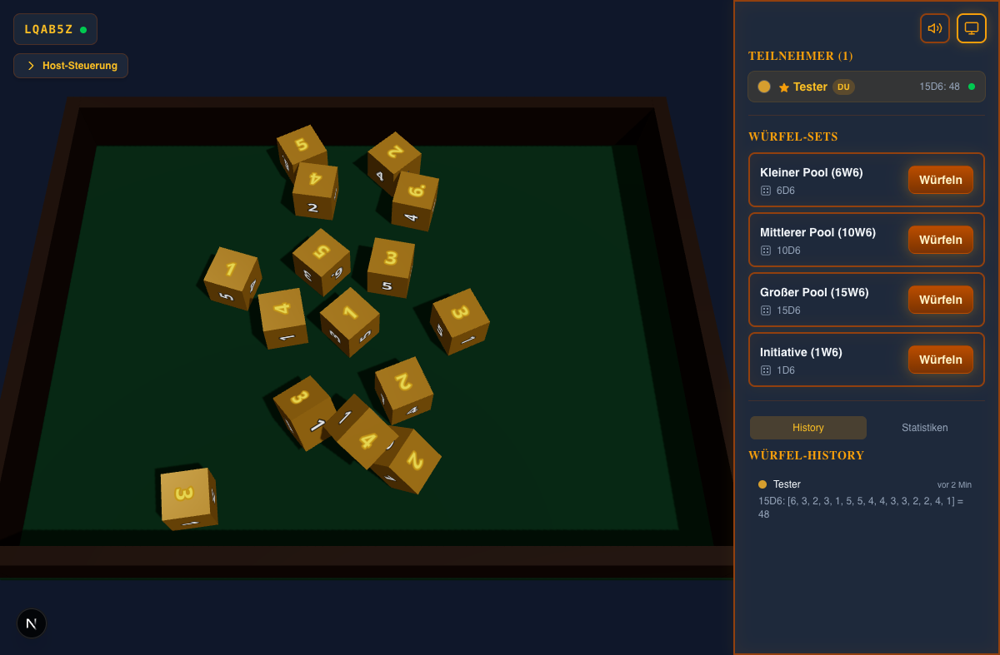
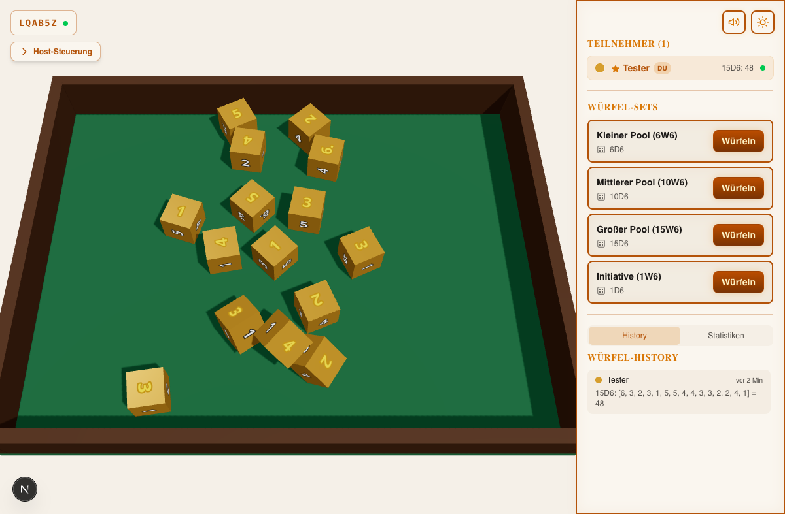
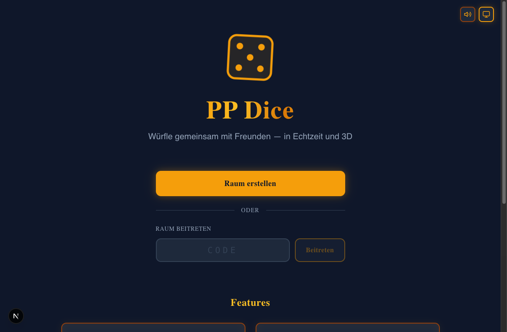
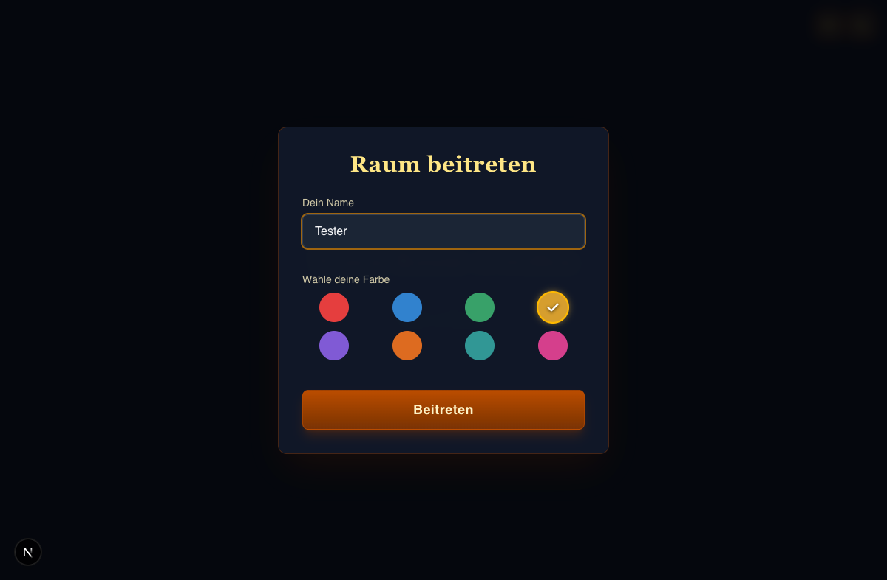

# PP Dice - Multiplayer 3D Dice Roller

A real-time multiplayer 3D dice roller for tabletop RPG sessions. Roll dice together with friends in beautifully rendered 3D with realistic physics.



## Features

- **3D Physics Dice** - Realistic dice simulation powered by cannon-es and Three.js. All standard RPG dice: D4, D6, D8, D10, D10X (percentile), D12, D20.
- **Real-Time Multiplayer** - Up to 8 players per room via WebSocket. Everyone sees dice rolls as they happen.
- **RPG Preset System** - Built-in presets for D&D 5e, DSA, Pathfinder 2e, Call of Cthulhu, Shadowrun 5e, Savage Worlds, Warhammer 40k, FATE/Fudge. Save your own custom presets.
- **Large Dice Pools** - Handles up to 15+ dice at once (e.g., Shadowrun or Warhammer pools) with intelligent spawn placement and automatic re-drop for stray dice.
- **History & Statistics** - Full roll history with per-die-type distribution charts.
- **Dark/Light Theme** - Adaptive 3D lighting and tray colors per theme.
- **Sound Effects** - Real dice rolling sounds with mute toggle.
- **Host Controls** - Room locking, player management, dice set configuration.

<details>
<summary>More Screenshots</summary>

### Light Mode


### Homepage


### Join Dialog


</details>

## Tech Stack

| Layer | Technology |
|-------|-----------|
| Framework | [Next.js 15](https://nextjs.org/) (App Router) |
| UI | [React 19](https://react.dev/), [Tailwind CSS 4](https://tailwindcss.com/) |
| 3D Rendering | [Three.js](https://threejs.org/), [@react-three/fiber](https://docs.pmnd.rs/react-three-fiber), [@react-three/drei](https://github.com/pmndrs/drei) |
| Physics | [cannon-es](https://pmndrs.github.io/cannon-es/) (server-side simulation) |
| Real-Time | [Socket.IO](https://socket.io/) |
| Language | TypeScript 5.7 |
| Testing | Vitest, Playwright |

## Getting Started

### Prerequisites

- Node.js 20+
- npm

### Installation

```bash
git clone https://github.com/cyklop/P-P-Dice.git
cd P-P-Dice
npm install
```

### Development

```bash
npm run dev
```

This starts the Next.js dev server with integrated Socket.IO on [http://localhost:3000](http://localhost:3000).

### Production

```bash
npm run build
npm start
```

## How It Works

1. **Create a Room** - Click "Raum erstellen" on the homepage. You become the host.
2. **Share the Code** - Share the 6-character room code or link with your friends.
3. **Configure Dice Sets** - As host, open "Host-Steuerung" to add dice sets manually or load presets (D&D 5e, DSA, etc.).
4. **Roll!** - Click "Wurfeln" on any dice set. The server runs a full physics simulation and streams the result to all players.

### Architecture

```
Client (Browser)                    Server (Node.js)
┌─────────────────────┐            ┌─────────────────────┐
│  React + Three.js   │            │  Socket.IO Handler   │
│  ┌───────────────┐  │  WebSocket │  ┌───────────────┐  │
│  │ DiceScene     │◄─┼────────────┼──│ Room Manager  │  │
│  │ (3D render)   │  │            │  └───────┬───────┘  │
│  └───────────────┘  │            │          │          │
│  ┌───────────────┐  │            │  ┌───────▼───────┐  │
│  │ usePhysics    │  │            │  │ Physics Engine │  │
│  │ Animation     │  │  frames[]  │  │ (cannon-es)   │  │
│  │ (playback)   ◄┼──┼────────────┼──│ (simulation)  │  │
│  └───────────────┘  │            │  └───────────────┘  │
└─────────────────────┘            └─────────────────────┘
```

Physics runs entirely on the server to prevent manipulation. The server sends pre-computed frame data to clients, which play back the animation in sync.

## Project Structure

```
src/
├── app/                    # Next.js App Router pages
│   ├── page.tsx           # Landing page
│   └── room/[code]/       # Dynamic room route
├── components/
│   ├── 3d/                # Three.js scene, dice, tray
│   ├── room/              # Room UI (sidebar, host panel, history)
│   └── ui/                # Shared UI (sound/theme toggles)
├── hooks/                 # React hooks (socket, sound, physics, theme)
├── lib/                   # Types, constants, geometry data, presets
└── server/                # Physics engine, room management, socket handlers
```

## License

[MIT](LICENSE)
